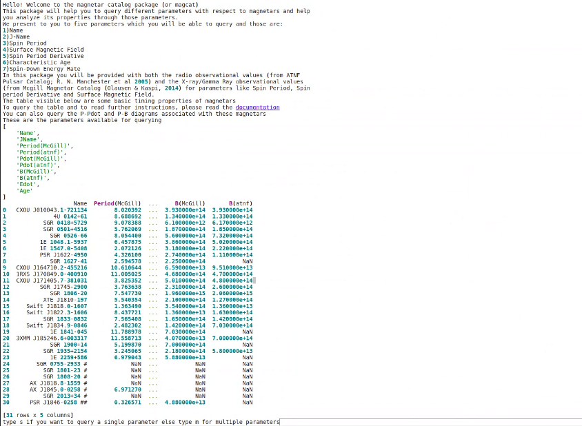
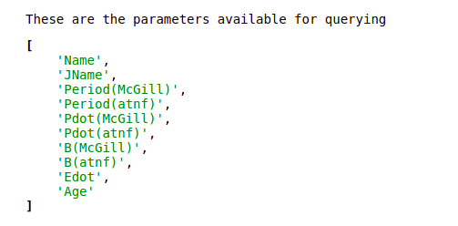
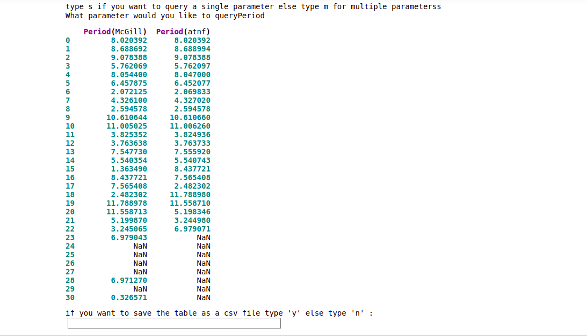
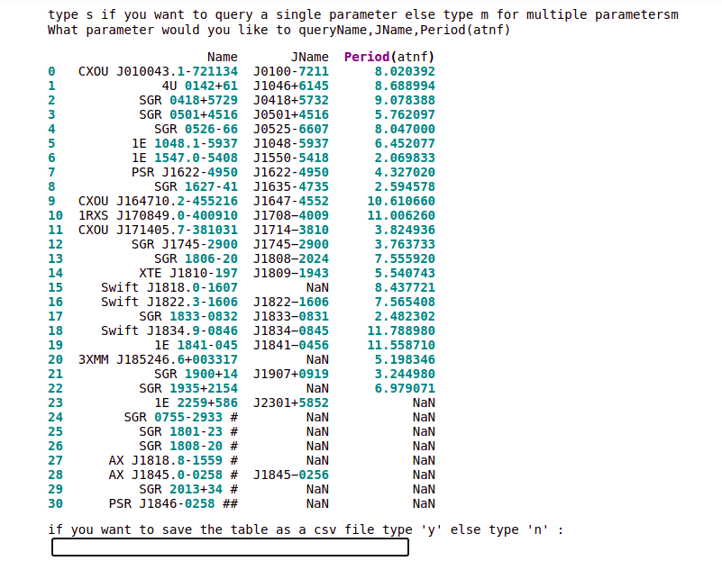
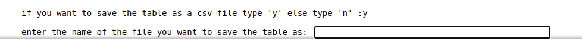
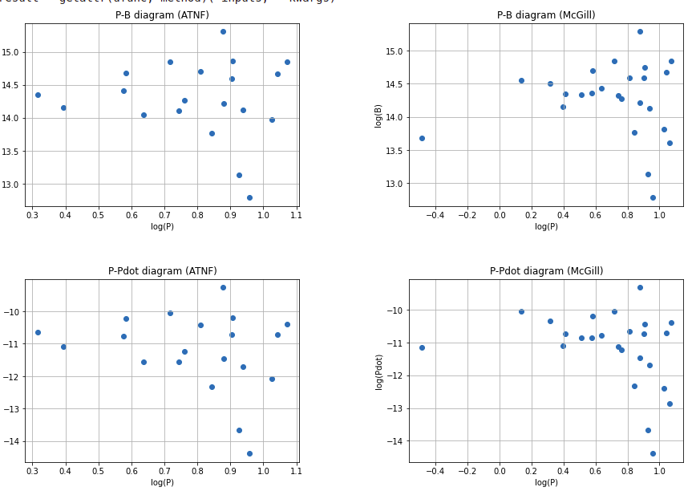

.. test documentation master file, created by
   sphinx-quickstart on Mon Aug 23 21:31:52 2021.
   You can adapt this file completely to your liking, but it should at least
   contain the root `toctree` directive.

.. include:: <isonum.txt>

.. _reference:

NScat - a python package to query neutron star parameters from publicly available databases.
==================

This python package is used for querying neutron star parameters from various publicly available databases. One of the databases we are queying is the McGill magnetar catalog  (Olausen & Kaspi, 2014), and please refer to the URL (http://www.physics.mcgill.ca/~pulsar/magnetar/main.html).

While using the catalog from the specified URL, the user neither has an option to search directly nor can search by specifying any conditions on the parameters of magnetars. 

This package attempts to solve this problem. It provides a python interface to the user to query the McGill Magnetar Catalog and will provide for several databases in the future. 
 

It is neither affiliated nor endorsed by the Magnetar group at McGill University or any other group and university. 

Comments and suggestions are welcome. This package is under development. 

Installation
============

This package is right now uploaded on the test instance of PyPI so it can be installed using the following command:-

This command can be run on the Ananconda prompt on Windows and the Linux terminal for Linux users. The can package can installed using::
         
                     ``pip install -i https://test.pypi.org/simple/ mag-pip-rc1`` 

Requirements
------------

The requirements for installing the code are:

 * :mod:`requests`
 * :mod:`pandas`
 * :mod:`numpy`
 * :mod:`io`
 * :mod:`matplotlib`
 * :mod:`rich`
 

Examples
========

Downloading the full database can be simply achieved via

    >>> from mag_pip_rci import code
    >>> mag = code.mag1()
    
   
   
   
   
The package will display the names, spin periods and magnetic fields of these magnetars and ask the user to give an input for querying single or multiple parameters. Type 's' for single and 'm' for multiple. You will be able to see a list of parameters that can be queried in this package.
  
  

  
  

The parameters that can be queried are:

For single input:

For multiple  inputs:

For saving the queried table as a CSV file, the user will be asked to type 'y' or 'n' in case he wants to save it, ifv given 'y' then another input needs to be given by specifying the <filename>.csv

 
 
 
 
If you want to save the table as a csv file, please write the <filename>.csv  

The user can also qyery the P-B plot and P-Pdot plot for these magnetars.

.. image:: asking_plots.png
  :width: 1500

The plots after querying

