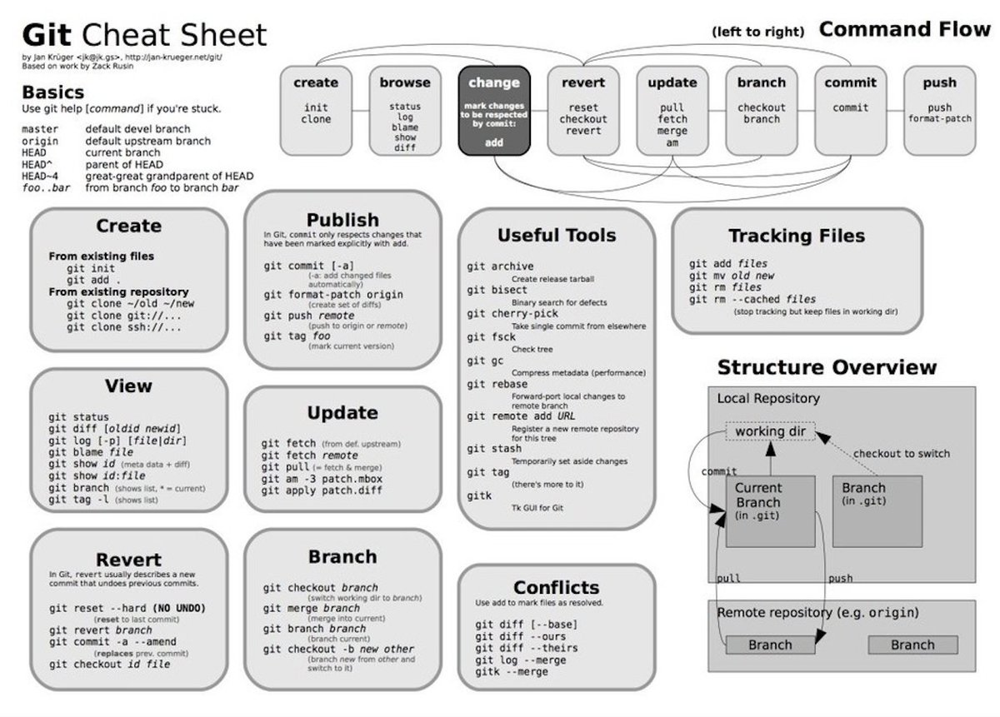

.. test documentation master file, created by
   sphinx-quickstart on Mon Aug 23 21:31:52 2021.
   You can adapt this file completely to your liking, but it should at least
   contain the root `toctree` directive.

.. include:: <isonum.txt>

.. _reference:

The McGill-Magnetar-Catalog
==================

.. automodule:: magcat

This python package is used for querying the McGill magnetar catalog,  (Olausen & Kaspi, 2014), and please refer to the URL (http://www.physics.mcgill.ca/~pulsar/magnetar/main.html).

While using the catalog from the specified URL, the user neither has an option to search directly nor can search by specifying any conditions on the parameters of magnetars. 

This package attempts to solve this problem. It provides a python interface to the user to query the McGill Magnetar Catalog. 

We also plan to add a graph plotter. 

It is neither affiliated nor endorsed by the Magnetar group at McGill University. 

Comments and suggestions are welcome. This package is under development. 

Installation
============

This package is right now uploaded on the test instance of PyPI so it can be installed using the following command:-

This command can be run on the Ananconda prompt on Windows and the Linux terminal for Linux users. The can package can installed using::
         
                     ``pip install -i https://test.pypi.org/simple/ mag-pip-rc1`` 

Requirements
------------

The requirements for installing the code are:

 * :mod:`requests`
 * :mod:`pandas`
 * :mod:`numpy`
 * :mod:`io`
 * :mod:`matplotlib`
 

Examples
========

Downloading the full database can be simply achieved via

    >>> from mag_pip_rci import code
    >>> mag = code.mag()
    
    
   
To search by specifying condition of parameters(in this e.g-spin period)

   >>> mag.loc[(mag['Period < 5']), ['Name', 'Period']]
   
   >>> mag.loc[(mag['Name'] == '1E 1841-045'), ['Name', 'RA', 'Decl','Age','Ref_Radio', 'Ref_MidIR', 'Assoc', 'SNRAge']]    
   
   
.. image:: docs/git.jpg/git.jpg
  :width: 400
  

 
